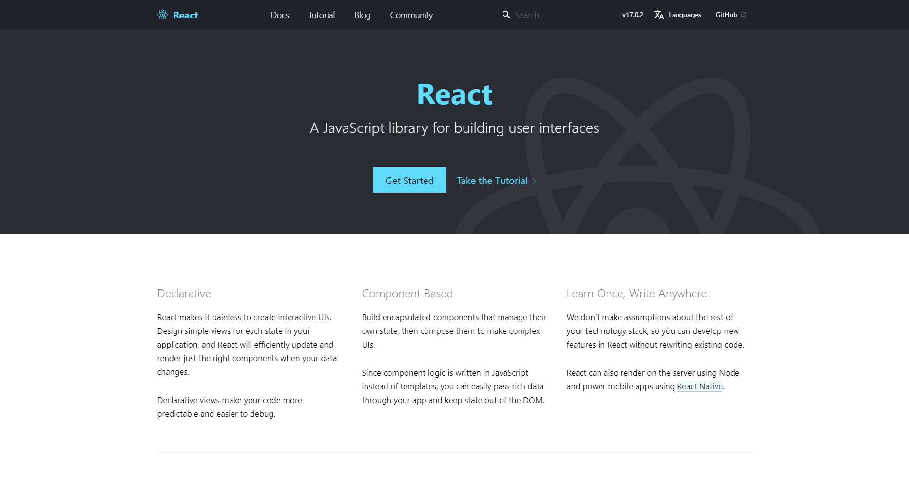
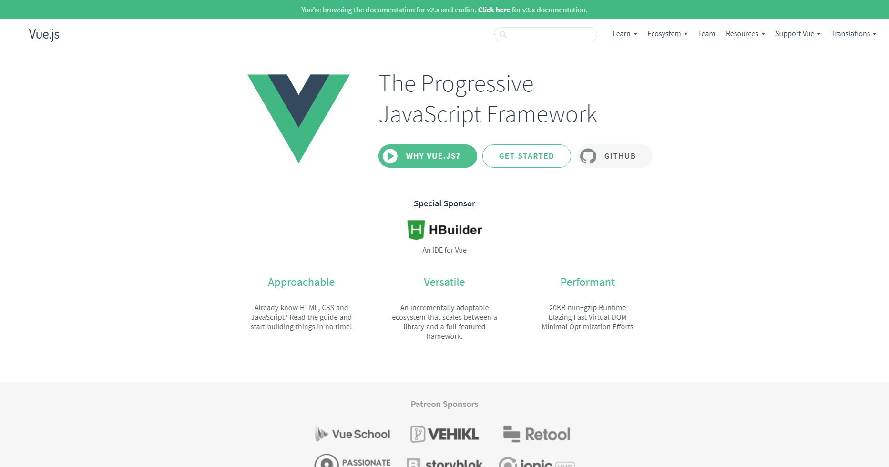

# Taller de Desarrollo de Aplicaciones Web con React, Vue y Angular

Presenta [Alan Badillo Salas](mailto:dragonnomada123@gmail.com)

[](https://simposiodcni.cua.uam.mx/inicio)

## Introducción

Este taller está dirigido a estudiantes, académicos y profesionales interesados en el desarrollo de aplicaciones web que deseen insertarse de una forma transparente en el uso de los *frameworks* de desarrollo web más populares del mercado, los cuáles son [React JS](https://reactjs.org), [Vue](https://vuejs.org) y [Angular](https://angular.io).

El objetivo del taller se centra en dominar de cada framework los siguientes puntos.

* **Arquitectura del Proyecto** - Dominar la estructura y organización de los archivos involucrados en el framework.
* **Piezas de Código** - Dominar el diseño y construcción de las piezas de software necesarias para una aplicación web bajo el framework.
* **Intercambio de Datos** - Dominar la comunicación de datos entre múltiples piezas de software, como módulos, servicios, contextos, estados, propiedades y acciones.
* **Patrones de Diseño** - Dominar los conceptos relacionados al diseño de los patrones utilizados por el framework para la solución de problemas relacionados al desarrollo de aplicaciones web.

## React JS

[React JS](https://reactjs.org) es un framework desarollado y mantenido por [Facebook](https://opensource.fb.com/projects/).



Los principales conceptos de React son los siguientes.

* **Basado en Componentes** - Un componente es un fragmento visual funcional, el cuál a través de un DOM Virtual controla una vista a través de una función.
* **Reactivo** - Los componentes interactúan con el usuario y detectan las acciones solicitadas por el usuario, para ser interceptadas dentro de la función que controla el componente, para cambiar el estado visual.
* **Funcionalidad Anclada** - Los Hooks de React son piezas lógicas que permiten abstraer operaciones externas del componente que pueden ser recicladas. El objetivo de los Hooks es extender las posibilidades del componente reteniendo estados, disparando efectos, consumiendo contextos, reduciendo lógica, etc.


### Arquitectura del Proyecto

Un proyecto de React se compone de los siguientes archivos.

> Arquitectura de un Proyecto de React JS

```txt
public/
    index.html

src/
    App.js
    index.js
    styles.css

package.json
```

Archivo | Descripción
--- | ---
`public/index.html` | Archivo base de la aplicación web. Aquí se define el documento base HTML y la etiqueta `<div id="root">` dónde se montará el componente principal.
`src/App.js` | Componente principal. Este archivo exporta el componente visual principal que será montado en la etiqueta `<div id="root">`.
`src/index.js` | Archivo de entrada al montado del componente principal. Aquí se recupera el elemento `<div id="root"` para montar el componente principal `<App />`.
`src/styles.css` | Archivo de estilos globales. Aquí se adaptan los estilos CSS que afectarán a todos los componentes.
`package.json` | Archivo del proyecto. Aquí se describe un JSON que indica el nombre del proyecto, versión, autor, licencia, scripts de compilación y la dependencia de módulos del pryecto.

### Piezas de Código

Existen diferentes piezas de código que se pueden utilizar para construir componentes. Cada fragmento de código puede ser colocado en un archivo `*.js` independiente o dónde convivan varios fragmentos a la vez.

Pieza de Código | Sintaxis | Descripción
--- | --- | ---
Importación de una pieza exportada por defecto | `import <nombre> from <ruta>` | Importa una pieza exportada por defecto desde la ruta. Esta ruta puede ser un archivo local relativo como `"./components/<nombre archivo>"` o desde una librería marcada en las dependencias del proyecto como `"<nombre librería>"`.
Importación de una pieza exportada | `import { <nombre> } from <ruta>` | Importa una pieza exportada por la ruta. Un archivo o librería podría exportar de forma parcial piezas de código como variables, funciones, componentes, etc.
Variable Fija | `const <nombre> = <valor>` | Declara y asigna una variable no reasignable (inmutable) que retiene un valor. Por ejemplo `const frutas = ["manzana", "pera", "mango"]`.
Variable | `let <nombre>` | Declara una variable que puede ser asignada en cualquier momento (mutable). Esta variable puede retener cualquier valor y tipo de dato soportado. Por ejemplo `let contador`, en cualquier momento se le podría asignar o cambiar su valor como `contador = 1` o `contador += 1`.
Función | `function <nombre>(<parámetros>) { <bloque> }` | Define una función nombrada que acepta los parámetros establecidos y ejecúta el bloque de código. Por ejemplo `function suma(a, b) { return a + b }`. La función puede ser llamada mediante `const resultado = suma(1, 2)`. Si la función no devuelve explícitamente nada, el valor retornado será `undefined`.
Callback flecha | `(<parámetros>) => <expresión>` | Un callback es una función no nombrada (expresión lambda o función flecha), la cuál es consumida y almacenada como una variable, pero puede ser utilizada como una función. Es útil cuándo una función requiere a otra función para delegar funcionalidad. Por ejemplo `onClick((evento) => console.log("Se ha dado click", evento))`.
Componente | `function <nombre>({ <propiedades> }) { <bloque> }` | Los componentes son funciones que reciben un objeto de propiedades que es deconstruído dentro de variables. Cuándo el componente es definido, puede ser utilizado dentro de otros componentes mediante el montaje en etiquetas. Por ejemplo `function Titulo({ texto }) { return <h1>{ texto }</h1> }`, así el componente `Titulo` se puede utilizar ahora en otros componentes como `function App() { return <Titulo texto="Hola mundo" /> }`. Los atributos envíados en la contrucción de la etiqueta son recibidos como propiedades, es decir, `<Titulo texto="Hola mundo" />` será recibido como `function Titulo({ texto })` y la variable `texto` contendrá el `string` `"Hola mundo"`. Se pueden enviar datos complejos también como `<Reloj hora={12} minuto={34} segundo={23} />` y se recibirá en las propiedades como `function Reloj({ hora, minuto, segundo })`, de tal forma que las variables `hora = 12`, `minuto = 34` y `segundo = 23`.
Hook `useState` | `const [<nombre>, <ajustador>] = useState(<valor inicial>)` | Los estados de un componente serán retenidos uno por uno mediante el consumo del Hook `useState`. Este devolverá un arreglo con la variable que mantiene el valor actual del estado y un ajustador que será una función que al ser llamada actualice el valor actual del estado por uno nuevo. Por ejemplo `const [total, setTotal] = useState(0)`. La variable `total` tendrá el valor inicial de `0` y cada que se mande a llamar a la función `setTotal(<nuevo valor>)` el valor de la variable `total` será actualizado y el componente se volverá a pintar.
Hook `useEffect` | `useEffect(<callback>, [<dependencias>])` | Los efectos son funciones `callback` que son llamados cada que el valor de una dependencia cambia. Las dependencias son una lista de variables que están siendo inspeccionadas cuándo su valor cambia. El efecto permite observar si los estados han cambiado para realizar operaciones lógicas, como calcular nuevos estados o consumir alguna función. Por ejemplo `useEffect(() => { setTotal(productos.reduce((total, producto) => total + producto.precio, 0), [productos]) })`, este efecto calcula el nuevo valor del total cada que los productos cambian.

Existen más piezas de código disponibles en React, sin embargo, estás son las fundamentales para comenzar a desarrollar aplicaciones productivas.

### Intercambio de Datos

El intercambio de datos es fundamental para poder solucionar problemas que involucren varias piezas de código, por ejemplo, pasar información de un componente a otro, determinar cuándo ha ocurrido algo dentro de un componente, etc.

> Paso de datos de un componente superior a un componente inferior

```jsx
function Title({ texto, contador }) {
    return <h1>{ texto } {contador}</h1>
}

function App() {
    const [conteo, setConteo] = useState(0)

    return <Title texto="Hola mundo" contador={conteo} />
}
```

> Paso de datos de un componente inferior a un componente superior

```jsx
function BotonContador({ onContadorActualizado }) {
    const [contador, setContador] = useState(0)

    useEffect(() => {
        onContadorActualizado(contador)
    }, [contador])

    return <button onClick={() => setContador(contador + 1)}>Incrementar: {contador}</button>
}

function App() {
    return <BotonContador onContadorActualizado={contador => alert(contador)} />
}
```

Existen más formas para el intercambio de datos entre componentes, como el uso de Reductores y también mediante el uso de Contextos. Sin embargo, pasar datos directos entre componentes es la forma más rápida y eficiente.

### Patrones de Diseño

Un patrón de diseño permite estandarizar en un equipo de trabajo el flujo del proyecto sobre las piezas de código. Contar con estos estándares le permitirá a la empresa tener proyectos uniformes que sean fáciles de escalar y mantener. Por ejemplo, si la empresa necesita agregar o corregir funcionalidad sobre las piezas de código nuevas o previas, podrá hacerlo de forma consistente sin que los programadores tengan que aprender modos partículares no estandarizados en los que fueron construídas las piezas de código.

Existen patrones de diseño organizacionales en la arquitectura del proyecto, dónde se establece dónde serán colocadas las nuevas piezas de código, según su tipo, por ejemplo.

> Organización de las piezas de código

```txt
public/
    index.html

src/
    components/
        <component>/
            index.js
            style.module.css
            hooks.js
    context/
        <context>/
            index.js
            initialState.js
            provider.js
    redux/
        <slice>/
            index.js
            state.js
            actions.js
            reducer.js
    App.js
    index.js
    styles.css

package.json
```

También existen patrones de diseño sobre las mismas piezas de código. Estos patrones involucran nomenclaturas convenidas, como usar mayúsculas y minúsculas en los nombres de variables, funciones, servicios, contextos, etc. Igualmente los patrones de diseño pueden definir cómo se implementará una lógica de negocio de alcance global, local, las reglas y validaciones de datos y en cómo serán separados.

> Lógica para las Entidades del Negocio - Crear Hooks personalizados

```jsx
export function useCarritoCompras() {
    const [usuarioId, setusuarioId] = useState(null)
    const [productos, setProductos] = useState([])
    const [estaAbierto, setEstaAbierto] = useState(false)
    const [estaBloqueado, setEstaBloqueado] = useState(false)
    const [total, setTotal] = useState(0)

    useEffect(() => {
        const total = productos.reduce((total, producto) => total + producto.precio, 0)

        setTotal(total)

        if (productos.length === 0 || total === 0) {
            setBloqueado(true)
        }
    }, [productos])
    
    const abrirCarrito = (usuarioId) => {
        setUsuarioId(usuarioId)
        setEstaAbierto(false)
        setEstaBloqueado(true)

        api.openShoppingCart(usuarioId).then(result => {
            if (result.open) {
                setEstaAbierto(true)
            } else {
                console.warn(`No se pudo abrir el carrito para`, usuarioId)
            }
        }).catch(error => {
            console.warn(`Error al abrir el carrito para`, usuarioId)
            console.error(error)
        }).then(() => {
            setEstaBloqueado(false)
        })
    }

    const agregarProducto(producto) {
        setProductos([
            ...productos,
            producto
        ])
    }

    return {
        usuarioId,
        productos,
        total,
        estaAbierto,
        estaBloqueado,
        abrirCarrito
    }
} 
```

## Vue JS

[Vue JS](https://vuejs.org) fue desarrollado por [Evan You](https://twitter.com/youyuxi) y es mantenido por la [Comunidad de Vue](https://github.com/vuejs/vue/blob/dev/BACKERS.md).



* **Basado en Componentes** - Un componente se define a partir de tres piezas diferenciables de código: Una plantilla de vista que podrá consumir los datos del componente y a otros componentes, un objeto componente, el cuál retendrá los datos, métodos y funcionalidad sobre el componente y finalmente el estilo, que podrá encapsular el diseño de la vista.
* **Reactivo** - Los componentes permiten interceptar las acciones que ocurren dentro de la vista y cambiar el estado interno de datos.
* **Funcionalidad Heredada** - Los componentes pueden heredar funcionalidad y propiedades enlazadas fácilmente de sus superiores, así como notificar cambios internos.

### Arquitectura del Proyecto

Un proyecto de Vue se compone de los siguientes archivos.

> Arquitectura de un Proyecto de Vue JS

```txt
public/
    index.html

src/
    App.vue
    main.js

package.json
```

Archivo | Descripción
--- | ---
`public/index.html` | Archivo base de la aplicación web. Aquí se define el documento base HTML y la etiqueta `<div id="app">` dónde se montará el componente principal.
`src/App.vue` | Componente principal. Este archivo exporta el componente visual principal que será montado en la etiqueta `<div id="app">`.
`src/main.js` | Archivo de entrada al montado del componente principal. Aquí se recupera el elemento `<div id="app"` para montar el componente principal `<App />`.
`package.json` | Archivo del proyecto. Aquí se describe un JSON que indica el nombre del proyecto, versión, autor, licencia, scripts de compilación y la dependencia de módulos del pryecto.

### Piezas de Código

Existen diferentes piezas de código que se pueden utilizar para construir componentes. Cada fragmento de código puede ser colocado en un archivo `*.js` independiente o dónde convivan varios fragmentos a la vez.

Pieza de Código | Sintaxis | Descripción
--- | --- | ---
Plantilla Visual | `<template>...</template>` | Define el fragmento de vista que será mostrado al usuario. Por ejemplo `<template><h1>{{ title }}</h1></template>`
Componente | `export default { ... }` | Establece el componente exportado dentro de la etiqueta `<script>`, este contendrá las definiciones de los datos, métodos, propiedades, etc. Por ejemplo `export defautl { data() { return { title: "Hola mundo" } }, methods: { onTitleClick() { this.title = "Hey!" } } }`
Nombre del componente | `name: <name>` | Establece el nombre del componente que será utilizado al montarlo como etiqueta. Por ejemplo `name: "Titulo"` podrá ser utilizado como `<Titulo>`.
Propiedades | `props: [<name>]` | Define la lista u objeto de propiedes. Una propiedad es un atributo envíado desde la etiqueta de montado. Por ejemplo `props: ["a", "b"]` para `<Componente a="usuario" b="producto">`. Las propiedades están enlazadas generalmente a datos del componente superior.
Estado del componente | `data() { return <estado inicial> }` | Se puede establer el estado inicial del componente mediante la función `data()`, esta computará el estado inicial y lo devolverá. Por ejemplo `data() { return { titulo: "Hola mundo", esVisible: true } }`.
Estado computado del componente | `computed: { <nombre>() { return <valor> } }` | Define un estado computado con acceso al estado del componente. Es útil para definir estados que se crean a partir de otro y no necesitan ser retenidos por el componente. Por ejemplo `computed: { total() { return this.productos.reduce((total, producto) => total + producto.precio, 0) } }`
Métodos | `methods: { <nombre>(<parámetros>) { ... } }` | Define funciones que pueden ser consumidas dentro de la vista del componente o dentro de otros métodos del componente. Estos tienen acceso al estado del componente. Por ejemplo `methods: { addProduct(product) { this.products.push(product) } }`, permite usar el método en la vista como `<button @click="addProduct(producto)">Agregar Producto</button>`.

Existen más piezas de código disponibles en Vue, sin embargo, estás son las fundamentales para comenzar a desarrollar aplicaciones productivas.

### Intercambio de Datos

En el desarollo de aplicaciones es fundamental controlar el intercambio de datos entre las piezas de código. Veamos como se logra entre componentes de Vue.

> Paso de datos de un componente superior a un componente inferior

```html
<!-- Componente inferior: Titulo -->
<template>
    <h1>{{ titulo }}</h1>
</template>

<script>
export default {
    name: "Titulo",
    props: ["texto", "contador"],
    computed: {
        titulo() {
            return this.$props.texto + " " + this.$props.contador
        }
    }
}
</script>

<!-- Componente Superior: App -->
<template>
    <div>
        <Title texto="Hola mundo" :contador="conteo" />
    </div>
</template>

<script>
import Titulo from "./components/Titulo"

export default {
    name: "App",
    components: {
        Titulo
    },
    data() {
        return {
            conteo: 0
        }
    }
}
</script>
```

> Paso de datos de un componente inferior a un componente superior

```html
<!-- Componente Inferior: BotonContador -->
<template>
    <button @click="incrementarContador">Incrementar: {{ contador }}</button>
</template>

<script>
export default {
    name: "BotonContador",
    data() {
        return {
            contador: 0
        }
    },
    methods: {
        incrementarContador() {
            this.contador = this.contador + 1

            this.$emit("ContadorActualizado", this.contador)
        }
    }
}
</script>

<!-- Componente Superior: App -->
<template>
    <div>
        <BotonActualizado @ContadorActualizado="contadorActualizado" />
    </div>
</template>

<script>
import BotonContador from "./components/BotonContador"

export default {
    name: "App",
    components: {
        BotonContador
    },
    data() {
        return {
            conteo: 0
        }
    },
    methods: {
        contadorActualizado(contador) {
            alert(contador)
        }
    }
}
</script>
```

Existen más formas para el intercambio de datos entre componentes, como el uso de *Stores*. Sin embargo, pasar datos directos entre componentes es la forma más rápida y eficiente.

## Patrones de Diseño

Uno de los patrones de diseño más utiles en Vue es utilizar Vuex, el cuál aporta un sistema de almacenes modulares basados en el concepto `estado-reducción`.

El almacén (`store`) es conceptualizado como la unión de un estado (`state`), mutaciones (`mutations` o reductores) y acciones (`actions` o procesadores).

En la siguiente tabla se muesta una descripción de estos tres conceptos.


Pieza de Código | Descripción
--- | ---
`state: () => ({ <name>: <value> })` | El estado de un `store` retiene datos del almacén que pueden ser consumidos por cualquier componente. En el estado se retienen datos como una lista de productos, si el usuario ya inició sesión o datos temporales de la aplicación.
`getters: { <name>: (state) => <value> }` | Los accesores son similares a los estados computados (`computed`) y permiten acceder al estado para computar algún valor sin retenerlo dentro del estado. Los accesores son usados para devolver valores como el total de los productos almacenados en el estado, si el usuario es válido, o en general datos que son derivados del estado y no hay necesidad de retenerlos y estarlos actualizando.
`mutations: { <name>: (state, <payload>) => { ... } }` | Las mutaciones o reductores son funciones que reciben el estado y los datos encomendados a realizar una actualización del estado. Por ejemplo, se podría tener una mutación que actualice el precio de un producto del estado como `mutations: { updateProductPrice: (state, { productId, price }) => { ... } }` y en cualquier componente podría ejecutarse `this.$store.commit("updateProductPrice", { productId: "123", price: 10.5 })`.
`actions: { <name>: async (context, <payload>) => { ... } }` | Las acciones o despachadores, son funciones con acceso al almacén y sus mutaciones. Estas soportan código asíncrono, pudiendo realizar operaciones con APIs y al obtener los resultados ejecutar las mutaciones correspondientes. Por ejemplo, una acción que requiera iniciar sesión en el API, esperar a que retorne los resultados y luego ejecutar las mutaciones de `updateUsername`, `updateToken`, `signIn`, etc.

Finalmente se pueden construir arquitecturas y estructuras para la organización de los proyectos que consideren incorporar estos patrones de diseño.

> Organización de las piezas de código

```txt
public/
    index.html

src/
    api/
        <function>.js
        index.js
    components/
        <component>.vue
    stores/
        <module>.js
        index.js
    App.vue
    main.js

package.json
```
